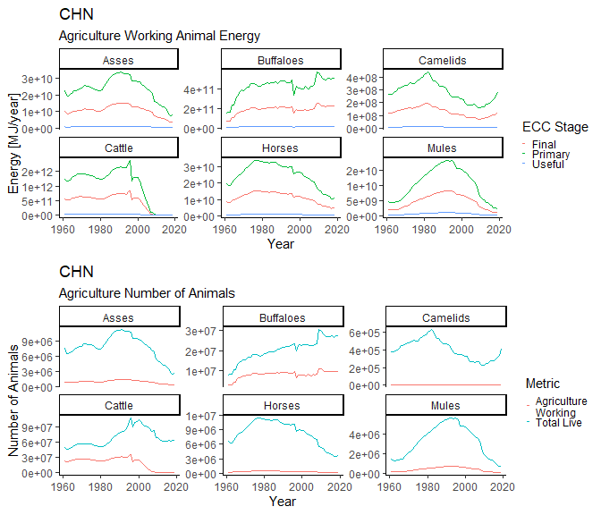

<!-- README.md is generated from README.Rmd. Please edit that file -->

# MWTools

<!-- badges: start -->
<!-- badges: end -->

The `R` package `MWTools` provides functions for the calculation of
human and animal muscle work for use in Societal Exergy Analysis (SEA)
using the Physical Supply Use Table (PSUT) framework.

## Installation

You can install the development version from
[GitHub](https://github.com/) with:

``` r
# install.packages("devtools")
devtools::install_github("EnergyEconomyDecoupling/MWTools")
```

## Animal Muscle Work

Raw data for the calculation of animal muscle work is obtained from the
Food and Agriculture Organisation of the United Nations Statistical
Database (FAOSTAT), via the `R` package `FAOSTAT`. The `MWTools` package
provides a wrapper function for downloading data for the number of live
animals, `down_fao_live_animals`, which utilises the function
`FAOSTAT::get_faostat_bulk()`. Once downloaded `MWTools` provides a
number of functions for the calculation of the number of working animals
by species, country, year and in agriculture, transport, and in total.
The helper function `calc_amw_numbers` returns a tidy data frame
containing

``` r
library(MWTools)

amw_numbers_df <- calc_amw_numbers(data_folder = file.path(PFUSetup::get_abs_paths()$project_path, "Data", "FAO Data"))

head(amw_numbers_df)
#> # A tibble: 6 x 7
#>   MW.Region.code Country.code  Year Species  Sector Live.animals Working.animals
#>   <chr>          <chr>        <dbl> <chr>    <chr>         <dbl>           <dbl>
#> 1 WAS            AFG           1961 Asses    Total       1300000        1154307.
#> 2 WAS            AFG           1961 Asses    Agric~      1300000         173146.
#> 3 WAS            AFG           1961 Asses    Trans~      1300000         981161.
#> 4 WAS            AFG           1961 Buffalo~ Total             0              0 
#> 5 WAS            AFG           1961 Buffalo~ Agric~            0              0 
#> 6 WAS            AFG           1961 Buffalo~ Trans~            0              0
```

The helper function `calc_amw_pfu` returns a tidy data frame containing
data for the primary, final, and useful energy by species, country, year
and in agriculture, transport, and in total.

``` r
amw_pfu_df <- calc_amw_pfu(data_folder = file.path(PFUSetup::get_abs_paths()$project_path, "Data", "FAO Data"))

head(amw_pfu_df)
#> # A tibble: 6 x 7
#>   MW.Region.code Country.code  Year Species Stage  Sector      `Energy [MJ/year~
#>   <chr>          <chr>        <dbl> <chr>   <chr>  <chr>                   <dbl>
#> 1 WAS            AFG           1961 Asses   Useful Total              831100990.
#> 2 WAS            AFG           1961 Asses   Useful Agriculture        124665149.
#> 3 WAS            AFG           1961 Asses   Useful Transport          706435842.
#> 4 WAS            AFG           1961 Asses   Final  Total            12685716572.
#> 5 WAS            AFG           1961 Asses   Final  Agriculture       1902857486.
#> 6 WAS            AFG           1961 Asses   Final  Transport        10782859086.
```

Use the `plot_amw_summary` function to produce a plot summarising the
animal muscle work data for a particular country and sector.

``` r
plot_amw_summary(amw_pfu_df = amw_pfu_df,
                 amw_numbers_df = amw_numbers_df,
                 country = "CHN",
                 sector = "Agriculture")
```



## Human Muscle Work

Raw data for the calculation of human muscle work is obtained from the
International Labor Organisation (ILO), via the `R` package `Rilostat`.
The `MWTools` package provides a wrapper function for
`Rilostat::get_ilostat` which returns a tidy data frame containing the
number of employed persons by sector and sex, and the mean yearly
working hours by sector and sex…..

``` r
hmw_hours <- get_ilo_hmw_data()
#> Table HOW_TEMP_SEX_ECO_NB_A cached at C:\Users\earzm\AppData\Local\Temp\Rtmp8ILib4/ilostat/indicator-HOW_TEMP_SEX_ECO_NB_A-code-raw-20210418T0651.rds
#> Table EMP_TEMP_SEX_ECO_NB_A cached at C:\Users\earzm\AppData\Local\Temp\Rtmp8ILib4/ilostat/indicator-EMP_TEMP_SEX_ECO_NB_A-code-raw-20210418T0637.rds

head(hmw_hours)
#> # A tibble: 6 x 6
#>   Country.code Sex    Sector          Year  `Employed.persons~ `Working.hours [~
#>   <chr>        <chr>  <chr>           <chr>              <dbl>             <dbl>
#> 1 ABW          Sex: ~ Economic activ~ 1994               35940                NA
#> 2 ABW          Sex: ~ Economic activ~ 1994                  30                NA
#> 3 ABW          Sex: ~ Economic activ~ 1994                  10                NA
#> 4 ABW          Sex: ~ Economic activ~ 1994                  30                NA
#> 5 ABW          Sex: ~ Economic activ~ 1994                2170                NA
#> 6 ABW          Sex: ~ Economic activ~ 1994                 580                NA
```
