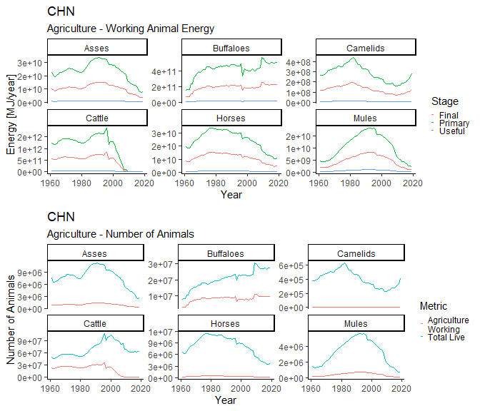

<!-- README.md is generated from README.Rmd. Please edit that file -->

# MWTools

<!-- badges: start -->

[](https://codecov.io/gh/EnergyEconomyDecoupling/MWTools?branch=master)
<!-- badges: end -->

The `R` package `MWTools` provides functions for the estimation of human
and animal muscle work for use in Societal Exergy Analysis (SEA), and
using the Physical Supply Use Table (PSUT) framework.

## Installation

You can install the development version from
[GitHub](https://github.com/) with:

``` r
# install.packages("devtools")
devtools::install_github("EnergyEconomyDecoupling/MWTools")
```

## Animal Muscle Work

Raw data for the estimation of animal muscle work is obtained from the
Food and Agriculture Organisation of the United Nations Statistical
Database (FAOSTAT), via the `R` package `FAOSTAT`. The `MWTools` package
provides a wrapper function for downloading data for the number of live
animals, `down_fao_live_animals`, which utilises the function
`FAOSTAT::get_faostat_bulk()`. Once downloaded `MWTools` provides a
number of functions for the calculation of the number of working animals
by species, country, year and in agriculture, transport, and in total.
The helper function `calc_amw_numbers` returns a tidy data frame
containing

``` r
library(MWTools)

fao_data <- MWTools::fao_amw_data

amw_numbers_df <- calc_amw_numbers(fao_data)

head(amw_numbers_df)
#> # A tibble: 6 x 7
#>   AMW.Region.code Country.code  Year Species Sector Live.animals Working.animals
#>   <chr>           <chr>        <dbl> <chr>   <chr>         <dbl>           <dbl>
#> 1 WAS             AFG           1961 Asses   Total       1300000        1154307.
#> 2 WAS             AFG           1961 Asses   Agric~      1300000         173146.
#> 3 WAS             AFG           1961 Asses   Trans~      1300000         981161.
#> 4 WAS             AFG           1961 Buffal~ Total             0              0 
#> 5 WAS             AFG           1961 Buffal~ Agric~            0              0 
#> 6 WAS             AFG           1961 Buffal~ Trans~            0              0
```

The helper function `calc_amw_pfu` returns a tidy data frame containing
data for the primary, final, and useful energy by species, country, year
and in agriculture, transport, and in total.

``` r
library(MWTools)

fao_data <- MWTools::fao_amw_data

amw_pfu_df <- calc_amw_pfu(fao_data)

head(amw_pfu_df)
#> # A tibble: 6 x 7
#>   AMW.Region.code Country.code  Year Species Stage  Sector     `Energy [MJ/year~
#>   <chr>           <chr>        <dbl> <chr>   <chr>  <chr>                  <dbl>
#> 1 WAS             AFG           1961 Asses   Useful Total             831100990.
#> 2 WAS             AFG           1961 Asses   Useful Agricultu~        124665149.
#> 3 WAS             AFG           1961 Asses   Useful Transport         706435842.
#> 4 WAS             AFG           1961 Asses   Final  Total           12685716572.
#> 5 WAS             AFG           1961 Asses   Final  Agricultu~       1902857486.
#> 6 WAS             AFG           1961 Asses   Final  Transport       10782859086.
```

Use the `plot_amw_summary` function to produce a plot summarising the
animal muscle work data for a particular country and sector.

``` r
plot_amw_summary(amw_pfu_df = amw_pfu_df,
                 amw_numbers_df = amw_numbers_df,
                 country = "CHN",
                 sector = "Agriculture")
```



## Human Muscle Work

Raw data for the estimation of human muscle work is obtained from the
International Labor Organisation (ILO), via the `R` package `Rilostat`.
The `MWTools` package includes bundled ILO data for the number of
employed persons by sector and mean number of working hours by sector,
retrieved by calling `MWTools::ilo_hmw_data`. This data is tidied with
the helper function `MWTools::tidy_ilo_data`.

``` r
ilo_data <- MWTools::ilo_hmw_data

tidy_ilo_data <- ilo_data %>% 
  MWTools::tidy_ilo_data()

head(tidy_ilo_data)
#> # A tibble: 6 x 8
#>   Country.code HMW.Region.code Sex    Sector Sector.hmw  Year `Employed.persons~
#>   <chr>        <chr>           <chr>  <chr>  <chr>      <dbl>              <dbl>
#> 1 ABW          <NA>            Female Agric~ Primary     1994                 10
#> 2 ABW          <NA>            Female Agric~ Primary     1997                 49
#> 3 ABW          <NA>            Female Agric~ Primary     2000                 37
#> 4 ABW          <NA>            Female Agric~ Primary     2007                 96
#> 5 ABW          <NA>            Female Agric~ Primary     2010                 74
#> 6 ABW          <NA>            Female Agric~ Primary     2011                 90
#> # ... with 1 more variable: Total.hours [hours/year] <dbl>
```

Using data for the number of employed persons and mean yearly working
hours the primary, final, and useful energy associated with human muscle
work can be estimated using the helper function `MWTools::calc_hmw_pfu`.

``` r
hmw_pfu_data <- MWTools::ilo_hmw_data %>%
  calc_hmw_pfu()

head(hmw_pfu_data)
#> # A tibble: 6 x 11
#>   Country.code HMW.Region.code Sex    Sector Sector.hmw  Year `Employed.persons~
#>   <chr>        <chr>           <chr>  <chr>  <chr>      <dbl>              <dbl>
#> 1 ABW          <NA>            Female Agric~ Primary     1994                 10
#> 2 ABW          <NA>            Female Agric~ Primary     1997                 49
#> 3 ABW          <NA>            Female Agric~ Primary     2000                 37
#> 4 ABW          <NA>            Female Agric~ Primary     2007                 96
#> 5 ABW          <NA>            Female Agric~ Primary     2010                 74
#> 6 ABW          <NA>            Female Agric~ Primary     2011                 90
#> # ... with 4 more variables: Total.hours [hours/year] <dbl>,
#> #   Final energy [MJ/year] <dbl>, Primary energy [MJ/year] <dbl>,
#> #   Useful energy [MJ/year] <dbl>
```
